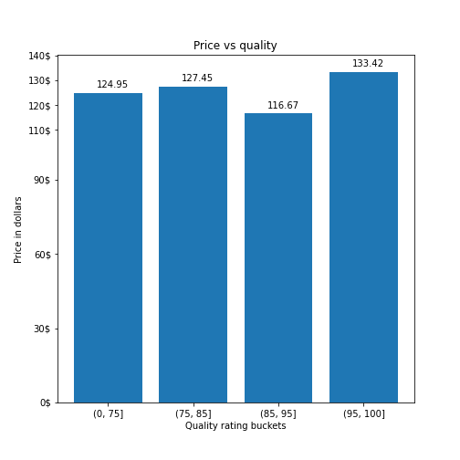
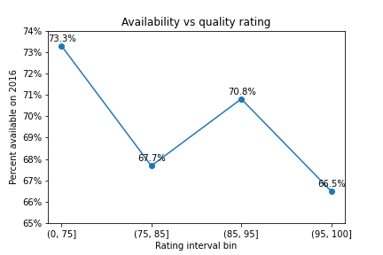

# Udacity data Scientist Nanodegree - Project 01

This repository contains the notebook and its outputs from my exploration of [Airbnb's Seattle dataset](https://www.kaggle.com/datasets/airbnb/seattle) (kindly shared by Udacity and Airbnb).

 ## Motivation

I use Airbnb as a guest very often and sometimes I wonder if I would want to become a host myself one day. With that in mind, my exploration focused on things like what influences perceived quality of a listing, also how quality correlates to price and vancancy (and ultimately income of the host).

## File structure

|–– visualizations - folder with output images from the analysis

|–– Capstone project 01.ipynb - jupyter file where the analysis was made

## Stack

- [Jupyter notebooks](https://jupyter.org/)
- [python library matplotlib](https://matplotlib.org/)
- [python library seaborn](https://seaborn.pydata.org/)
- [python library pandas](https://pandas.pydata.org/)
- [python library numpy](https://numpy.org/)

## Summary of results

Quality was found to have stronger lineasr correlations with the type of property and quality of the bed. Elements associated with host commitment (response time and cancelation policy) also correlated strongly with our metric for quality.

Increasing quality hinted at higher listing price on average. We also found that higher quality listings tended to have lower vacancies over the year on average. All listings correborated with these conclusions except the ones on the 85 to 95 range. More investigatioon is needed to understand the reasons of this anomaly.

Here are some of the visualizations produced in this analysis:

## Blog post link

https://medium.com/@matheusbafutto/what-can-data-tell-us-about-airbnb-listings-quality-and-their-price-d98930a14d92

## Acknoledgements

Here are the sources I have visited while putting this project together.

- https://stackoverflow.com/questions/61960929/extract-only-columns-that-contains-true-value-from-a-dataframe-in-pandas
- https://stackoverflow.com/questions/25351968/how-can-i-display-full-non-truncated-dataframe-information-in-html-when-conver
- https://kanoki.org/2019/11/12/how-to-use-regex-in-pandas/
- https://towardsdatascience.com/cleaning-and-extracting-json-from-pandas-dataframes-f0c15f93cb38
- https://intellipaat.com/community/20261/element-wise-logical-or-in-pandas
- https://www.datacamp.com/community/tutorials/wordcloud-python
- Udacity Data Scientist Nanodegree - Course materials
- https://www.fcc.gov/media/radio/dms-decimal
- pandas, matplotlib and python docs
